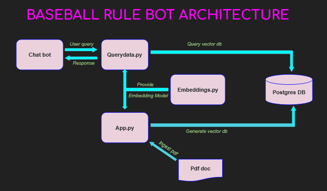

# :baseball: BASEBALL RULE BOT :robot:

A simple RAG application develeloped as part of [Microsoft RAG Hackathon](https://github.com/microsoft/RAG_Hack/)

### Architecture

### Technical specs:
| Frontend | streamlit |
| --- | --- |
| LLM | Ollama3.1 and Mistral |
| Database/vectorsource | postgres |
| Orchastrator | Langchain |
| Programming language | Python |
| Document source | pdf |

### Demo video
https://www.youtube.com/watch?v=UBik1mXR5bI

### Thanks to :heart:
[Pamela Fox](https://github.com/pamelafox)
 
[Marlene Mhangami](https://github.com/marlenezw)
 
Joshua Johnson
 
[Anthony Chu](https://github.com/anthonychu)
 

